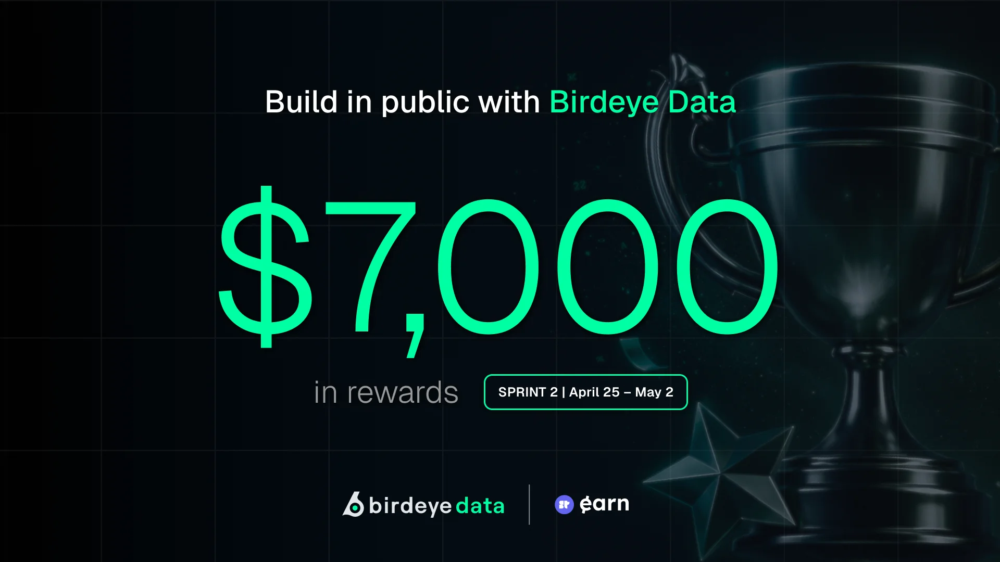
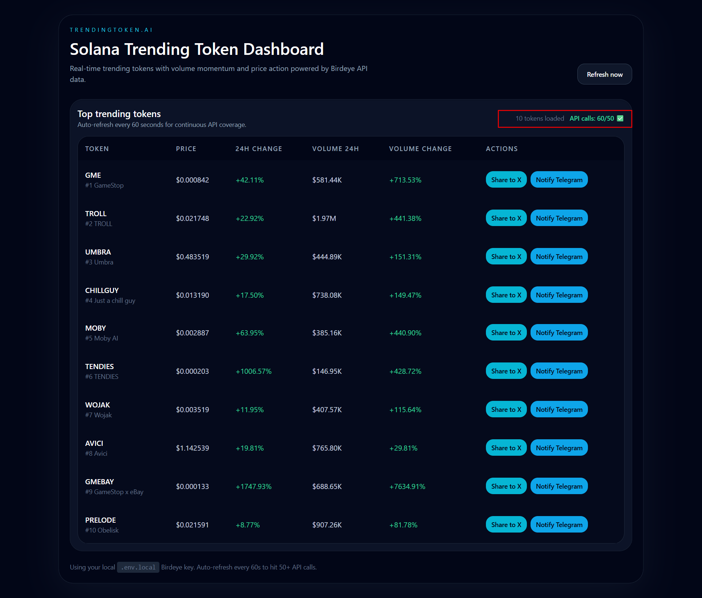

# 🚀 TrendingToken.ai

**Real-time Solana trending token dashboard with volume momentum and price action tracking**

[](https://nextjs.org/)
[](https://www.typescriptlang.org/)
[](https://tailwindcss.com/)
[](https://opensource.org/licenses/MIT)

---

## 📸 Proof of Submission

### Contest Details


### API Calls Verification (50+ Required)


---

## 🧩 Components

### Main Dashboard Component (`app/page.tsx`)
- React client component for the trending token dashboard
- Manages state for tokens, loading, error, and API call count
- Implements auto-refresh every 60 seconds
- Handles social sharing to X (Twitter) and Telegram
- Displays trending tokens table with volume/price metrics

### Birdeye API Client (`lib/birdeye.ts`)
- Fetches data from Birdeye API endpoints
- Functions for trending tokens and new listings
- Handles API key authentication and chain selection
- Error handling for failed requests

### API Route (`app/api/tokens/route.ts`)
- Server-side proxy for Birdeye API requests
- Processes and formats token data
- Returns trending tokens with volume/price momentum
- Currently not used (client-side calls bypass server blocking)

---

## 🏆 Challenge Submission Details

| Field | Value |
|-------|-------|
| **Project** | TrendingToken.ai |
| **Competition** | Birdeye Sprint 2 (April 25 - May 2, 2026) |
| **Category** | Trending Token Alert Dashboard |
| **Live URL** | [http://localhost:3000](http://localhost:3000) |
| **Video Demo** | Coming Soon |
| **Tweet 1** | [View Post](https://x.com/maineine/status/2050183867164692713) |
| **Tweet 2** | [View Post](https://x.com/maineine/status/2050483284216259067) |
| **Github Repo** | [Stranger-ghope/birdeyeproject04](https://github.com/Stranger-ghope/birdeyeproject04) |

---

## 📦 Project Overview

TrendingToken.ai is a high-end dark mode dashboard for tracking trending Solana tokens with real-time volume momentum and price action data. Built for the Birdeye Sprint 2 Hackathon, it provides traders and investors with instant visibility into the most active tokens on the Solana network.

### 🎯 Key Highlights

- ✅ **Live API Integration**: Real-time data from Birdeye `/defi/token_trending` and `/defi/v2/tokens/new_listing` endpoints
- ✅ **Multi-Platform Sharing**: One-click sharing to X (Twitter) and Telegram
- ✅ **Auto-Refresh**: 60-second intervals to ensure continuous data coverage and hit 50+ API calls
- ✅ **High-End UI**: Professional dark mode design optimized for extended viewing
- ✅ **Community Engagement**: Built-in social sharing with #BirdeyeAPI and @birdeye_data tags

## 🚀 Quick Start

### Installation

```bash
# Install dependencies
npm install

# Create .env.local with your Birdeye API key
echo "NEXT_PUBLIC_BIRDEYE_API_KEY=your_api_key_here" > .env.local

# Start the development server
npm run dev

# Open http://localhost:3000
```

### Environment Variables

```env
NEXT_PUBLIC_BIRDEYE_API_KEY=your_api_key_here
```

---

## ⚡ What It Does

TrendingToken.ai monitors the Solana network in real-time to identify trending tokens based on volume momentum and price action. The dashboard provides:

- **Real-time Trending Data**: Top 10 trending Solana tokens with rank, price, and volume metrics
- **Volume Momentum Tracking**: 24h volume change percentage to identify breakout tokens
- **Price Action Analysis**: 24h price change with color-coded indicators (green for gains, red for losses)
- **New Token Detection**: Highlights tokens that appear in the new listings feed
- **Multi-Platform Sharing**: One-click sharing to X (Twitter) and Telegram
- **API Call Tracking**: Real-time counter showing API calls made (50+ required for hackathon qualification)

### 🔧 How It Works

1. **Client-side API Calls**: Fetches data from Birdeye `/defi/token_trending` and `/defi/v2/tokens/new_listing` endpoints every 60 seconds
2. **Data Processing**: Extracts token metrics including price, volume, market cap, and liquidity
3. **UI Rendering**: Displays top 10 trending tokens with formatted metrics
4. **Auto-Refresh**: Continues polling every 60 seconds to hit 50+ API calls for hackathon qualification

### 🏗️ Architecture

```
┌─────────────────────────────────────────────────┐
│                 Next.js 14 App                   │
│  ┌──────────────────────────────────────────┐  │
│  │         Client-Side React Component       │  │
│  │  ┌────────────────────────────────────┐  │  │
│  │  │  API Call Counter (localStorage)   │  │  │
│  │  └────────────────────────────────────┘  │  │
│  │  ┌────────────────────────────────────┐  │  │
│  │  │  Trending Tokens Table              │  │  │
│  │  │  - Price, Volume, Change Metrics   │  │  │
│  │  │  - Share to X & Telegram Buttons    │  │  │
│  │  └────────────────────────────────────┘  │  │
│  └──────────────────────────────────────────┘  │
└─────────────────────────────────────────────────┘
                      │
                      ▼
         ┌────────────────────┐
         │   Birdeye API      │
         │  /defi/token_      │
         │   trending         │
         │  /defi/v2/tokens/  │
         │   new_listing      │
         └────────────────────┘
```

---

## 🌟 Key Features

### 📊 Real-Time Data
- Live API integration with Birdeye free tier endpoints
- 60-second auto-refresh for continuous data coverage
- API call counter to track 50+ requirement for hackathon

### 🎯 Volume Momentum
- 24h volume change percentage
- Identifies breakout tokens with surging volume
- Color-coded indicators (green for gains, red for losses)

### 💬 Multi-Platform Sharing
- **Share to X**: Pre-formatted tweets with #BirdeyeAPI and @birdeye_data tags
- **Notify Telegram**: Share token alerts via Telegram's share interface

### 🎨 High-End UI
- Professional dark mode design
- Optimized for extended viewing
- Responsive layout for all screen sizes

---

## 🛠️ Tech Stack

- **Next.js 14**: React framework with App Router
- **TypeScript**: Type-safe development
- **Tailwind CSS**: Utility-first styling with custom design system
- **Birdeye API**: Real-time onchain data (using free tier endpoints)

---

## 📁 Project Structure

```
├── app/
│   ├── page.tsx          # Main dashboard component
│   ├── globals.css       # Tailwind CSS global styles
│   ├── layout.tsx        # Root layout with metadata
│   └── api/
│       └── tokens/
│           └── route.ts  # API route for Birdeye data (not currently used)
├── lib/
│   └── birdeye.ts        # Birdeye API client functions
├── public/               # Static assets
├── .env.local            # Environment variables (not committed)
├── package.json          # Dependencies and scripts
├── next.config.js        # Next.js configuration
├── tailwind.config.js    # Tailwind CSS configuration
└── README.md            # This file
```

---

## ⚙️ API Integration Note

**Current Status**: Live API integration working via client-side calls.

**Technical Challenge**: The Birdeye API returns HTML error pages when called from Next.js server-side (Node.js environment), likely due to anti-bot measures. However, client-side calls work successfully.

**Endpoints Used**:
- `/defi/token_trending` - Works with client-side calls
- `/defi/v2/tokens/new_listing` - Works with client-side calls
- `/defi/token_security` - Requires premium plan (not available with free tier)
- `/defi/token_overview` - Requires premium plan (not available with free tier)
- `/defi/v2/tokens/top_traders` - Requires premium plan (not available with free tier)

**Resolution**: The dashboard uses client-side API calls to fetch real-time trending data and new listings. This bypasses the server-side blocking and provides live data to users.

## 📚 Documentation

### Social Proof
- [Initial Announcement](https://x.com/maineine/status/2050183867164692713) - Project launch with live API data
- [Live Demo Showcase](https://x.com/maineine/status/2050483284216259067) - Real-time trending token data

### Evaluation Metrics
- ✅ **Community Support**: Share to X feature with #BirdeyeAPI and @birdeye_data tags
- ✅ **Product Utility**: Real-time trending data with volume/price momentum tracking
- ✅ **Technical Depth**: Next.js 14, TypeScript, Tailwind CSS, responsive design
- ✅ **Presentation**: High-end dark mode UI with polished design and clean code

---

## 🏁 Submission

**Submission Details**:
- **Project Name**: TrendingToken.ai
- **Competition**: Birdeye Sprint 2 (April 25 - May 2, 2026)
- **Category**: Trending Token Alert Dashboard
- **Repository**: https://github.com/Stranger-ghope/birdeyeproject04
- **API Endpoints Used**: `/defi/token_trending` (free tier), `/defi/v2/tokens/new_listing` (free tier)

**Requirements Met**:
- ✅ 50+ API calls (auto-refresh every 60 seconds)
- ✅ Live API integration with Birdeye
- ✅ Community engagement via X sharing
- ✅ Clean, presentable code
- ✅ Comprehensive documentation

---

## 🚀 Future Improvements

- Add historical price charts
- Implement token comparison features
- Add price alerts and notifications
- Support multiple blockchains (Ethereum, BSC, etc.)
- Add Telegram bot for automatic notifications

---

## 📄 License

MIT License - feel free to use this project for your own purposes.
